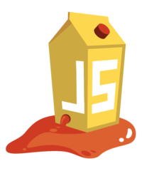


# Cross Site Scripting (XSS)

---

## 1. Teil

---

## Security Lab und Juice Shop

* Saftladen mit Sicherheitslücken
* OWASP: Open Web Application Security Project
* Top Ten der Sicherheitsprobleme
* Ganz oben: Cross-Site-Scripting

Quelle: https://github.com/bkimminich/juice-shop

---

## reflected XSS attack
```javascript
<script>alert("XSS1")</script>
```
* Forms
* Url parsing

---

## persisted XSS attack
```javascript
<script>alert("XSS2")</script>
```
* Database
* "external Scripts"

---

## Social Engineering
* Aktives Zustimmen der User ermöglicht den Angriff
* Skriptblocker

---

## Xenotics Framework


Quelle: https://www.owasp.org/index.php/OWASP_Xenotix_XSS_Exploit_Framework

---

## Beef unter Kali Linux
* Kali Linux: Penetration Testing Distribution
* BeEF Project: Browser Exploitation


Quelle: picateshackz.com, funinformatique.com 

---

## 2. Teil

---

## Xenotics Framework
* Send Message
* Keylogger credentials (und anderes?)
* Social Engineering: Kamera aktivieren und Live-Webcam
* Screenshot machen
* Phisher: auf andere Website weiterleiten
* Persistent Browser Keylogger "Update installieren"

---

## Fazit
* Vielfältige Angriffe sind möglich
* Vertraue keinen externen Scripten
* Script block notwendig => Whitelist
