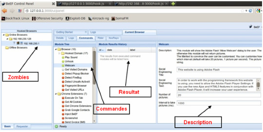

# Cross Site Scripting (XSS)

---

## Security Lab und Juice Shop

<small>Quelle: http://bkimminich.github.io/juice-shop/#/</small>

---

## OWASP

* Open Web Application Security Project
* Top Ten der Sicherheitsprobleme
* Ganz oben: XSS

---

## XSS

* Webserver Schadcode platzieren
* Zugriff der User über Browser
* Ungefilterte Inhalte werden von Webserver weitergreicht
* Skripte werden ausgeführt

---

## reflected XSS attack

Demo: https://tinyurl.com/y8gt8rw7

---

## persisted XSS attack

* Über externe Scripte (z.B. Google Tag Manager)
* Datenbank (z.B. Feedback Formular)

---

## Beef Framework
* Kali Linux: Penetration Testing Distribution
* BeEF Project: Browser Exploitation

<small>Quelle: https://picateshackz.com, https://funinformatique.com</small>

---

## Xenotics Framework

<small>Quelle: http://www.owasp.org/index.php/OWASP_Xenotix_XSS_Exploit_Framework</small>

---

<iframe src="http://www.youtube.com/embed/HnhLMYjOOtQ?version=3&loop=1&playlist=HnhLMYjOOtQ" allowfullscreen="" frameborder="0" height="480" width="853"></iframe>

---

<iframe src="http://www.youtube.com/embed/eGOQqnfMdmI?version=3&loop=1&playlist=eGOQqnfMdmI" allowfullscreen="" frameborder="0" height="480" width="853"></iframe>

---

<iframe src="http://www.youtube.com/embed/RvYjfavvf2E?version=3&loop=1&playlist=RvYjfavvf2E" allowfullscreen="" frameborder="0" height="480" width="853"></iframe>

---

<iframe src="http://www.youtube.com/embed/qqv4887uWBk?version=3&loop=1&playlist=qqv4887uWBk" allowfullscreen="" frameborder="0" height="480" width="853"></iframe>

---

## Social Engineering
* nicht-technische Seite häufig nötig
* User werden manipuliert über falsche Informationen
* Aktives Zustimmen ermöglicht den Angriff
* z.B. Kamera aktivieren, Persistent Browser Keylogger "Update installieren"

---

## Fazit

* Cross-site Scripting ist böse :-)
* Webseiten müssen vor XSS geschützt werden
* Als Betreiber vertraue keinen externen Scripten
* Als Nutzer am besten Scriptblocker verwenden

<small>Quelle: https://tinyurl.com/yd59aypx</small>